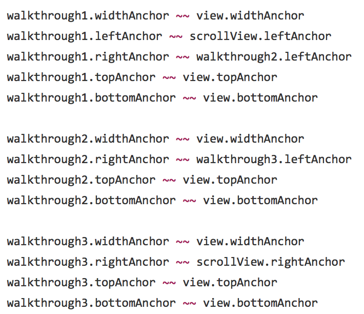

SuperLayout
===========

SuperLayout is a library that adds a few custom operators to Swift that makes using the new NSLayoutAnchor API in iOS 9 much less verbose and a pleasure to use. It doesn't override already-defined methods in `Equatable` (such as `==` and `>=`), like other frameworks do, and defines ones that are logical and easily understandable to anyone who might be inheriting your codebase or joining your team. The `equalTo` operator is just a `~`, and the greater than or equal to and less than or equal to operators are just `Option` + `<` and `Option` + `>`, respectively.

In short, turn this:


Into this:



Installation
------------

SuperLayout is available via CocoaPods and SwiftPM. In your Podfile, just specify:

    pod 'SuperLayout', '~> 0.2'

### Before You Use

To use this library, you should have a basic understanding of the [`NSLayoutAnchor` API](https://developer.apple.com/reference/uikit/nslayoutanchor). If not, read up, and then check out the reference below to get started.

## NSLayoutConstraint Reference

#### [constraint(equalTo:)](https://developer.apple.com/reference/uikit/nslayoutanchor/1500946-constraint)

➥ `viewA.rightAnchor ~~ viewB.leftAnchor`

<details>
  <summary>See original</summary>

  ```swift
  viewA.rightAnchor.constraint(equalTo: viewB.leftAnchor).isActive = true
  ```

</details>

---

#### [constraint(equalTo:constant:)](https://developer.apple.com/reference/uikit/nslayoutanchor/1500937-constraint)

➥ `viewA.rightAnchor ~~ viewB.leftAnchor + C`

<details>
  <summary>See original</summary>

  ```swift
  viewA.rightAnchor.constraint(equalTo: viewB.leftAnchor, constant: C).isActive = true
  ```

</details>

---

#### [constraint(greaterThanOrEqualTo:)](https://developer.apple.com/reference/uikit/nslayoutanchor/1500936-constraint)

➥ `viewA.rightAnchor ≥≥ viewB.leftAnchor`

<details>
  <summary>See original</summary>

  ```swift
  viewA.rightAnchor.constraint(greaterThanOrEqualTo: viewB.leftAnchor).isActive = true
  ```

</details>

---

#### [constraint(greaterThanOrEqualTo:constant:)](https://developer.apple.com/reference/uikit/nslayoutanchor/1500948-constraint)

➥ `viewA.rightAnchor ≥≥ viewB.leftAnchor + C`

<details>
  <summary>See original</summary>

  ```swift
  viewA.rightAnchor.constraint(greaterThanOrEqualTo: viewB.leftAnchor, constant: C).isActive = true
  ```

</details>

---

#### [constraint(lessThanOrEqualTo:)](https://developer.apple.com/reference/uikit/nslayoutanchor/1500953-constraint)

➥ `viewA.rightAnchor ≤≤ viewB.leftAnchor`

<details>
  <summary>See original</summary>

  ```swift
  viewA.rightAnchor.constraint(lessThanOrEqualTo: viewB.leftAnchor).isActive = true
  ```

</details>

---

#### [constraint(lessThanOrEqualTo:constant:)](https://developer.apple.com/reference/uikit/nslayoutanchor/1500959-constraint)

➥ `viewA.rightAnchor ≤≤ viewB.leftAnchor + C`

<details>
  <summary>See original</summary>

  ```swift
  viewA.rightAnchor.constraint(lessThanOrEqualTo: viewB.leftAnchor, constant: C).isActive = true
  ```

</details>

## NSLayoutDimension Reference

#### [constraint(equalTo:multiplier:)](https://developer.apple.com/reference/uikit/nslayoutdimension/1500951-constraint)

➥ `viewA.heightAnchor ~~ viewB.heightAnchor * M`

<details>
  <summary>See original</summary>

  ```swift
  viewA.heightAnchor.constraint(equalTo: viewB.heightAnchor, multiplier: M).isActive = true
  ```

</details>

---

#### [constraint(equalTo:multiplier:constant:)](https://developer.apple.com/reference/uikit/nslayoutdimension/1500934-constraint)

➥ `viewA.heightAnchor ~~ viewB.heightAnchor * M + C`

<details>
  <summary>See original</summary>

  ```swift
  viewA.heightAnchor.constraint(equalTo: viewB.heightAnchor, multiplier: M, constant: C).isActive = true
  ```

</details>

---

#### [constraint(equalToConstant:)](https://developer.apple.com/reference/uikit/nslayoutdimension/1500941-constraint)

➥ `viewA.heightAnchor ~~ C`

<details>
  <summary>See original</summary>

  ```swift
  viewA.heightAnchor.constraint(equalToConstant: C).isActive = true
  ```

</details>

---

#### [constraint(greaterThanOrEqualTo:multiplier:)](https://developer.apple.com/reference/uikit/nslayoutdimension/1500961-constraint)

➥ `viewA.heightAnchor ≥≥ viewB.heightAnchor * M`

<details>
  <summary>See original</summary>

  ```swift
  viewA.heightAnchor.constraint(greaterThanOrEqualTo: viewB.heightAnchor, multiplier: M).isActive = true
  ```

</details>

---

#### [constraint(greaterThanOrEqualTo:multiplier:constant:)](https://developer.apple.com/reference/uikit/nslayoutdimension/1500965-constraint)

➥ `viewA.heightAnchor ≥≥ viewB.heightAnchor * M + C`

<details>
  <summary>See original</summary>

  ```swift
  viewA.heightAnchor.constraint(greaterThanOrEqualTo: viewB.heightAnchor, multiplier: M, constant: C).isActive = true
  ```

</details>

---

#### [constraint(greaterThanOrEqualToConstant:)](https://developer.apple.com/reference/uikit/nslayoutdimension/1500939-constraint)

➥ `viewA.heightAnchor ≥≥ C`

<details>
  <summary>See original</summary>

  ```swift
  viewA.heightAnchor.constraint(greaterThanOrEqualToConstant: C).isActive = true
  ```

</details>

---

#### [constraint(lessThanOrEqualTo:multiplier:)](https://developer.apple.com/reference/uikit/nslayoutdimension/1500943-constraint)

➥ `viewA.heightAnchor ≤≤ viewB.heightAnchor * M`

<details>
  <summary>See original</summary>

  ```swift
  viewA.heightAnchor.constraint(lessThanOrEqualTo: viewB.heightAnchor, multiplier: M).isActive = true
  ```

</details>

---

#### [constraint(lessThanOrEqualTo:multiplier:constant:)](https://developer.apple.com/reference/uikit/nslayoutdimension/1500957-constraint)

➥ `viewA.heightAnchor ≤≤ viewB.heightAnchor * M + C`

<details>
  <summary>See original</summary>

  ```swift
  viewA.heightAnchor.constraint(lessThanOrEqualTo: viewB.heightAnchor, multiplier: M, constant: C).isActive = true
  ```

</details>

---

#### [constraint(lessThanOrEqualToConstant:)](https://developer.apple.com/reference/uikit/nslayoutdimension/1500963-constraint)

➥ `viewA.heightAnchor ≤≤ C`

<details>
  <summary>See original</summary>

  ```swift
  viewA.heightAnchor.constraint(lessThanOrEqualToConstant: C).isActive = true
  ```

</details>
